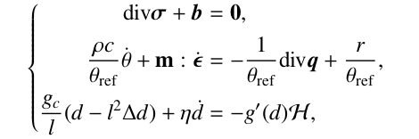
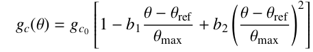
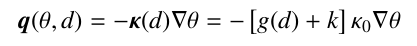
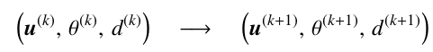
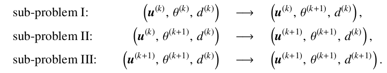
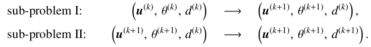
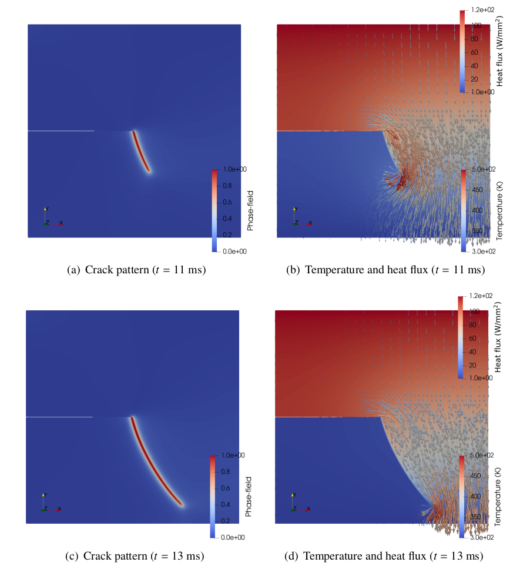
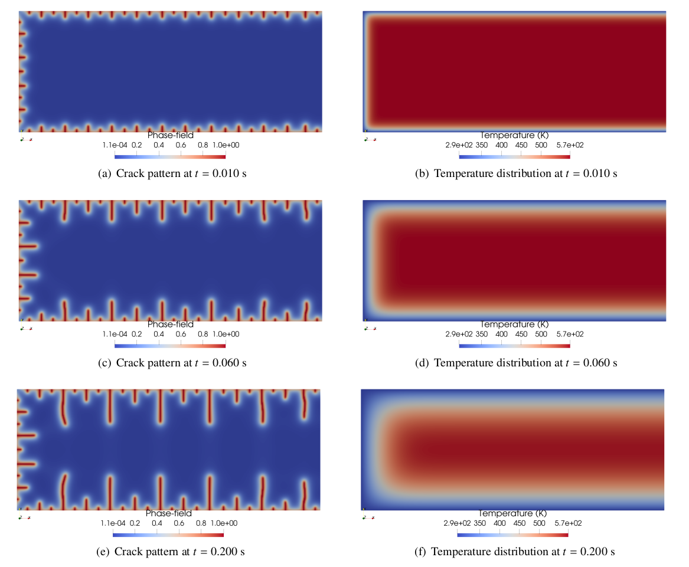
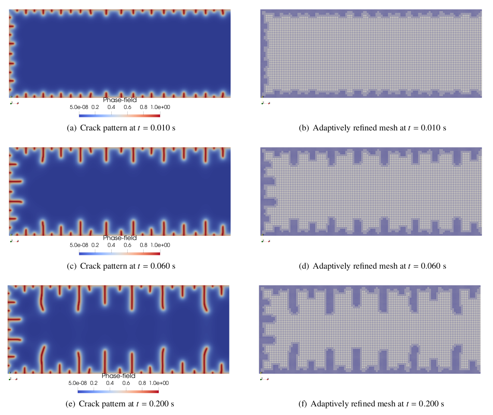
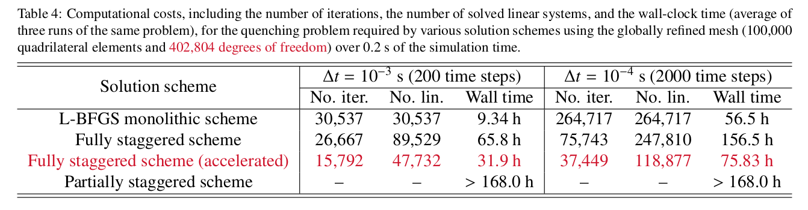

## Thermomechanical phase-field solving schemes
This repository provides three solving schemes for the thermomechanically coupled phase-field crack simulations, including the L-BFGS monolithic scheme, the fully staggered scheme, and the partially staggered scheme.

### Purpose
This repository provides the source code and the input files for the numerical examples used in the paper titled “Fully staggered, partially staggered, and monolithic schemes for thermomechanically coupled phase-field crack simulations: solver development and performance evaluation”. The tightly coupled governing equations are listed below

which are used to solve for the displacement field, the temperature field, and the phase-field. Particularly, the material critical energy release rate is a temperature-dependent property:

and the material thermal conductivity is degraded by the phase-field:

Three different solving schemes are provided:

1. L-BFGS monolithic scheme, which updates the three fields simultaneously:

2. Fully staggered scheme, which partitions the coupled problem into three sub-problems:

3. partially staggered scheme, which partitions the coupled problem into a displacement-temperature sub-problem and a phase-field sub-problem:

### Representative results
1. The combined effects of displacement-controlled shear load and thermal load:

2. Quenching test:

3. $L_2$-projection based adaptive mesh refinement

4. Comparison of the computational costs associated with the three solving schemes:

